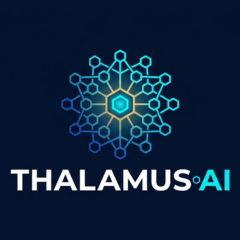

# THALAMUS AI
### World's First L4.5 Agent Platform

**By Aphantic Corporations**

*The most powerful all-purpose AI platform ever built — combining intelligent conversation, deep research, adaptive learning, autonomous code generation, and full OS virtualization in one unified experience.*

---

## 📖 Table of Contents

1. [What is Thalamus?](#-what-is-thalamus)
2. [The Four Modes](#-the-four-modes)
3. [The AI Agent System](#-the-ai-agent-system)
4. [The Sandbox & OS Emulator](#-the-sandbox--os-emulator)
5. [The VM Bridge](#-the-vm-bridge)
6. [The Installer](#-the-installer)
7. [The Desktop App](#-the-desktop-app)
8. [Supported Operating Systems](#-supported-operating-systems)
9. [GitHub Sync](#-github-sync)
10. [Authentication & Users](#-authentication--users)
11. [Credits & Billing](#-credits--billing)
12. [Admin Panel](#-admin-panel)
13. [Tech Stack](#-tech-stack)
14. [Project Structure](#-project-structure)
15. [Getting Started (Developers)](#-getting-started-developers)
16. [Environment Variables](#-environment-variables)
17. [Deployment](#-deployment)
18. [Frequently Asked Questions](#-frequently-asked-questions)

---

## 🧠 What is Thalamus?

Thalamus is a **Level 4.5 AI Agent Platform** — a term coined by Aphantic Corporations to describe an AI system that goes beyond simple question-answering. It can:

- **Understand** what you need, even if you don't know how to ask it
- **Research** topics in real time using live web data
- **Teach** you anything, from school subjects to advanced university topics
- **Build** complete software applications, websites, and tools from a plain English description
- **Run** actual operating systems (Windows, macOS, Linux, Android) inside your browser session

Think of it as having a brilliant friend who is simultaneously a doctor, lawyer, engineer, teacher, researcher, and software developer — available 24/7, never tired, never impatient.

### Who is it for?

| Person | How Thalamus Helps |
|--------|-------------------|
| **Students** | Explains lessons, creates practice questions, summarizes textbooks |
| **Professionals** | Drafts emails, reports, presentations, and research summaries |
| **Developers** | Writes, reviews, debugs, and deploys full applications |
| **Entrepreneurs** | Researches markets, writes business plans, builds MVPs |
| **Curious people** | Answers any question with depth, clarity, and accuracy |
| **Non-technical users** | Runs real operating systems without any technical knowledge |

---

## 🎯 The Four Modes

Thalamus has four distinct operating modes, each optimized for a different type of task. You can switch between them at any time.

---

### 💬 Chat Mode

**What it is:** A conversational AI that understands context, nuance, and intent.

**What you can do:**
- Ask any question and get a clear, accurate answer
- Have multi-turn conversations where the AI remembers what you said earlier
- Get help with writing — emails, essays, cover letters, social media posts
- Plan your day, week, or year
- Get advice on decisions, relationships, health, finance, and more
- Translate between languages
- Summarize long documents or articles

**How it works:**
- Powered by Claude (Anthropic via AWS Bedrock) and Gemini (Google) models
- Uses the most capable model available for your subscription tier
- Maintains full conversation history within a session
- Supports file uploads — paste text, upload documents, share images

**Example prompts:**

